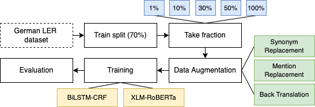



# Evaluation of Data Augmentation for Named Entity Recognition in the German Legal Domain

- We evaluate the effect of Synonym Replacement, Mention Replacement and Back-Translation augmentation techniques when applied to data from the German legal domain. 
- We assess this impact by training two NER models (BiLSTM-CRF, XLM-RoBERTa) on different fractions of the augmented data and thereby also explore how the impact relates to different dataset sizes.
- Our training and evaluation workflow is illustrated in the figure below. 
	- We take the train split of the dataset and then create 5 new datasets from it, consisting of different fractions (1%, 10%, 30%, 50%, 100%) of the full split. 
	- We then create a baseline by training the models on these untouched fractions of the train split and evaluating them on the test split. 
	- We evaluate the effect of the augmentation techniques by training the models on the augmented dataset fractions and evaluating them on the same untouched test split. 
	- A more detailed description of the workflow can be found in the paper.

- The **dataset** used is the **[German LER dataset](https://github.com/elenanereiss/Legal-Entity-Recognition)**.

## Setup

#### Environment

- We recommend to use the virtual environment tool `conda`.
- To setup the environment, execute the following commands:
	- `conda create --name flair-gpu`
	- `conda activate flair-gpu`
	- `conda install pytorch torchvision torchaudio cudatoolkit=11.3 -c pytorch`
	- `conda install pip`
	- `pip install -r requirements.txt`

#### OpenThesaurus

- We recommend to setup the OpenThesaurus mySQL database locally if it is to be used as source for Synonym Replacement with large datasets. 
- We used the database dump from the **30th of May 2022**. We make this specific version available on Zenodo: 
- Alternatively one can download the most recent dump [here](https://www.openthesaurus.de/about/download). 
	- If no database connection is provided, the augmentation script will use the (limited) [public API](https://www.openthesaurus.de/about/api).

#### Dataset

- Next, the dataset has to be downloaded from [here](https://github.com/elenanereiss/Legal-Entity-Recognition/tree/master/data). 
- The `ler.conll` file has to be renamed to `train.txt` and put into a folder called `LER_dataset` in the root folder. 
- Empty `test.txt` and `dev.txt` files should be created in the `LER_dataset`. 
- Finally, `python generate_datasets.py` can be executed in the root folder to split the dataset into train (70%), test (15%), and dev sets (15%) and create the training-split fractions. 
- The resulting datasets will be saved in the `src/datasets` folder.
- **This can be done using the following commands:**

1. `mkdir LER_dataset`
2. `curl https://raw.githubusercontent.com/elenanereiss/Legal-Entity-Recognition/master/data/ler.conll -o LER_dataset/train.txt`
3. `touch LER_dataset/dev.txt`
4. `touch LER_dataset/test.txt`
5. `python generate_datasets.py`

- The result consists of train/test/dev.txt files together with a collection of folders each one representing a training fraction and the same test/dev.txt files (e.g., folder `___0.5` represents the 50% split of the training set)
- This data is provided on Zenodo: 

## Run

#### Augmentation

- The augmentations can be performed with the following commands:
	- Synonym Replacement: `python aug/synonym_replace.py dataDir percentage source `
	- Mention Replacement: `python aug/mention_replace.py dataDir	`
	- Back-Translation:`./back-translate.sh`

- The parameters are defined as follows:
	- `source` can be either "fasttext", "clm" or "thesaurus".
	- `percentage` can be any value between 0 and 1.0, determining replacement percentage.
	- `dataDir` is the path to the directory that contains the train.txt, test.txt and dev.txt files.

- One example would be: `python aug/synonym_replace.py datasets/___1.0 0.2 clm`.
- We provide the list of commands that should be run to automatically perform all the augmentations ([`.\mention_replace.sh`](https://github.com/fusion-jena/data-augmentation-ner-legal/blob/main/src/mention_replace.sh), [`.\synonym_replace.sh`](https://github.com/fusion-jena/data-augmentation-ner-legal/blob/main/src/synonym_replace.sh), and [`.\backtranslate.sh`](https://github.com/fusion-jena/data-augmentation-ner-legal/blob/main/src/backtranslate.sh)).
- The final generated datasets are stored under `src/datasets/`.
	- folders beginning with "c" contain the combined version (original and generated).
	- folders beginning with "s" contain only the generated data.

- Note that running the evaluations with a certain target dataset always results in a list of augmented datasets:
	- for each dataset fraction (X) a folder containing X% of sentences in their original and augmented form (e.g., "c0.01MR", for mention replacement with 1% dataset fraction).
	- for each dataset fraction (X) a folder containing X% of sentences in their augmented form (e.g. "s0.1MR", for mention replacement with 10% dataset fraction).
- This implementation saves a considerable amount of time, because otherwise the first sentence would have to be augmented repeatedly (once for each dataset fraction).
- If only the full combined augmented set is of interest all datasets besides the dataset starting with "c1.0" may be deleted.

- To execute all augmentation techniques with all dataset fractions, run the following scripts:
	- `.\backtranslate.sh`
	- `.\mention_replace.sh`
	- `.\synonym_replace.sh`

- The generated datasets are provided on Zenodo: 

#### Model training and evaluation

- The evaluations can be in general run as follows:

`python model_bilstm.py <trainDir> <testDir> <learningRate> <batchSize> <storage>`

`python model_flert.py <trainDir> <testDir> <batchSize> <epochs>`

- The parameters are defined as follows:
	- `trainDir` - the path to the directory that contains the train.txt, test.txt and dev.txt files, of which the train.txt will be used for training.
	- `testDir` - the path to the directory that contains the train.txt, test.txt and dev.txt files, of which the test.txt will be used for evaluation.
	- `batchSize`- batch size of the model.
	- `learningRate` - learning rate of the model.
	- `epochs` - the maximum number of epochs trained for.
	- `storage` - where the embeddings are stored during training (affects performance, "gpu" is better than "cpu").

- We used the following parameters during our evaluation:
	- `python model_bilstm.py datasets/___1.0 datasets/___1.0 0.05 32 cpu`
	- `python model_flert.py  datasets/___1.0 datasets/___1.0 1 10`

- Note that this should be run to generate both baseline and augmented data results.
- The results are stored in `src/flert_results.csv` and `src/bilstm_results.csv` with, among others,  evaluation metrics, used augmentation method and dataset fraction. 

- To execute all the evaluations over all resulting datasets, run the following scripts:
	- `./evaluate_BiLSTM-CRF.sh`
	- `./evaluate_XLM-R.sh`
	
- The evaluation results are provided on Zenodo: 

## License

This project is licensed under the [MIT License](https://github.com/fusion-jena/data-augmentation-ner-legal/blob/master/LICENSE).